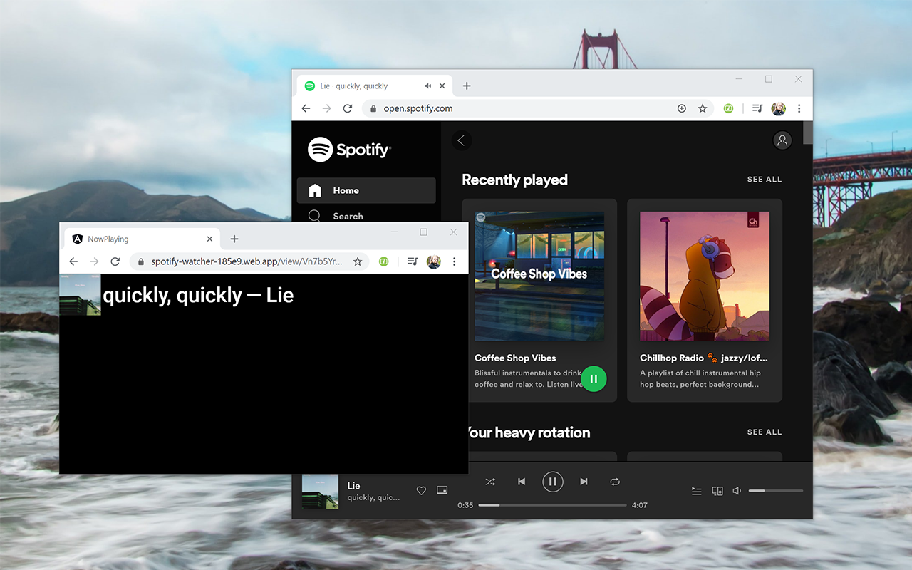

# Spotify Web Watcher

A web browser extension that watches the Spotify Web Player and reports what you are playing on a separate, private web page.

This tool is meant to be used in live-streaming software (like OBS) as an embedded web view that displays what you're listening to at the moment.

# Usage

0. Open the [Spotify Web Watcher on the Chrome Web Store](https://chrome.google.com/webstore/detail/bdmajojbomhndfchgmljkjihdpjhcefl)
1. Install the extension on your browser
2. (Optional) Pin the extension, so it's always visible
3. Open [Spotify Web Player](https://open.spotify.com)
4. If you are not already, log-in into Spotify

// TODO: Revise these steps. It may be best if the user turns the extension on/off
// TODO: Ensure the anonymous user sessions on Firebase get deleted after a certain amount of time

0. The extension icon will turn green
1. Click on the extension icon

2. Copy the URL
3. Use the URL on your streaming software as a "browser" source

## Contributing

The build process for this package requires `cp`, `rm` and `zip` to be available on your OS. This is probably fine for BSD/Linux and macOS environments, but if you are on a Windows environments, you might need to install some of them (probably `zip`).

## Privacy

I don't collect any of your data. All data is stored anonymously and is not shared with any third parties.

## License

[GNU GENERAL PUBLIC LICENSE](https://www.gnu.org/licenses/gpl-3.0.en.html)
